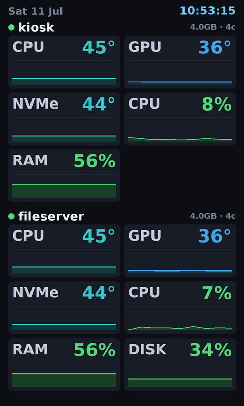

# csm-panel

Driver and host-metrics dashboard for the **CSM050H800480** 5″ 800×480 USB panel
(USB id `1a86:8040`, sold as a "PC sub-display / AIDA64 screen", board
`HJ-5.0-LCD-V03`). The panel's protocol was reverse-engineered from USB captures
of its Windows software — see [`PROTOCOL_NOTES.md`](PROTOCOL_NOTES.md).

The panel is effectively a **JPEG framebuffer**: you render an 800×480 image on
the host and upload it. This project renders a configurable, glanceable
dashboard (CPU, RAM, swap/zram, disks, network, temperatures) as sparkline cards
and pushes it on an interval. Metrics come from pluggable sources — the local
machine (`/proc`, zero config) and/or a **Beszel** hub for extra hosts.



## Install

Requires Python ≥ 3.11 and [uv](https://docs.astral.sh/uv/). The panel appears
as `/dev/ttyACM0`; your user must be in the `dialout` group
(`sudo usermod -aG dialout $USER`, then re-login).

```bash
uv sync                      # create the venv + install
uv run csm-panel model       # sanity check -> "CSM050H800480_14 NAND V0.2.8"
```

## Quick start

```bash
uv run csm-panel preview out.png   # render a frame to a PNG (no hardware)
uv run csm-panel once              # render + flash a single frame
uv run csm-panel run               # run the dashboard service (Ctrl-C to stop)
uv run csm-panel image photo.jpg   # flash any image file full-screen
```

With no config file it shows the local machine. Point at a config with
`-c path/to/config.toml`.

## Configuration

Copy [`config.example.toml`](config.example.toml) to
`~/.config/csm-panel/config.toml` and edit. Highlights:

```toml
[panel]
interval = 2.0      # refresh seconds
columns  = 2        # cards per row
rotate   = "ccw"    # mounting orientation: ccw (default) | cw | 180 | none

[[host]]            # hosts stack top-to-bottom
name    = "kiosk"
source  = "local"
metrics = ["temps", "cpu", "ram", "disk:/", "net"]   # order = display order
```

**Metric keys:** `cpu` `ram` `swap` `disk:/` `net` (=`rx`+`tx`) `rx` `tx`
`temps` (all sensors) or a specific `temp:CPU` / `temp:GPU` / `temp:NVMe`.
Omit `metrics` to show everything the source provides.

### Multiple hosts via Beszel

Beszel (already collecting your machines) is used as a data source for remote
hosts, including history for the sparklines:

```toml
[[host]]
name    = "fileserver"
source  = "beszel"
system  = "fileserver"          # its name in Beszel
metrics = ["temps", "cpu", "ram"]

[beszel]
url      = "http://127.0.0.1:8090"
email    = "you@example.com"
password = "…"                  # or:  token = "…"
```

Run `uv run csm-panel beszel-probe` to print exactly what your hub returns (use
it to adjust field mappings if your Beszel version differs).

## Run as a service

```bash
./systemd/install.sh            # venv + default config + enable systemd unit
systemctl status csm-panel
journalctl -u csm-panel -f
```

The unit ([`systemd/csm-panel.service`](systemd/csm-panel.service)) runs
`csm-panel run` as your user, restarts on failure, and starts after Beszel.

## Customizing the look

The UI is intentionally easy to change:

- **What's shown & order** — the `metrics` list per host in the config.
- **Colours / thresholds** — `csm_panel/dashboard.py`
  (`sev_color`, `ACCENT`) and the temperature scale `TEMP_STOPS` in
  `csm_panel/render.py`.
- **Layout** — `dashboard.render()` in `csm_panel/dashboard.py`; every metric is
  a `Metric` (value + history + fixed scale) drawn by `_card()`.
- **New data** — add a `Source` subclass (see `csm_panel/sources.py`) that
  returns `Host`/`Metric`; the renderer needs no changes.

## Layout of the code

| file | purpose |
|------|---------|
| `csm_panel/panel.py` | serial driver: `model()`, `flash(image)`, `send_theme()` |
| `csm_panel/theme.py` | build the panel's theme-package format from JPEGs |
| `csm_panel/render.py` | portrait canvas, rotation, sparkline/colour helpers |
| `csm_panel/metrics.py` | `/proc` + `/sys` collectors, history buffer |
| `csm_panel/sources.py` | normalized `Host`/`Metric` schema + `LocalSource` |
| `csm_panel/beszel.py` | Beszel hub source (multi-host) |
| `csm_panel/dashboard.py` | compose hosts → 480×800 dashboard |
| `csm_panel/service.py` | collect → render → flash loop |
| `tools/pcap_usb.py` | USBPcap decoder used to reverse the protocol |

## Troubleshooting

- **`could not open /dev/ttyACM0` / `usbfs`** — the USB device is claimed by
  another process (commonly a VM's USB passthrough). Detach it there so Linux's
  `cdc_acm` driver binds it.
- **Permission denied on the port** — add yourself to `dialout` and re-login.
- **Panel shows "Empty theme" spinner** — an invalid upload; make sure you're on
  a current build (the theme CRC/length must be correct).
